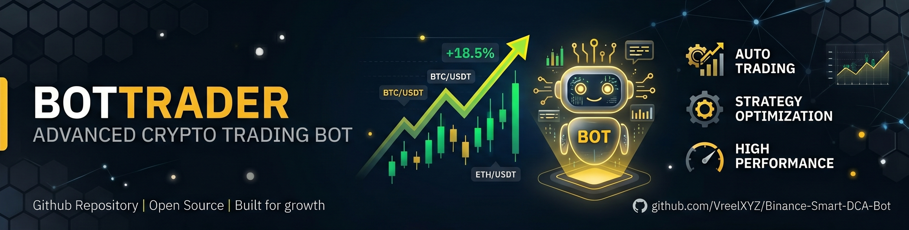

# 🚀 BotTrader: Binance Smart DCA Dual-Strategy Suite



Tired of staring at charts or missing perfect entries during market swings? **BotTrader** is a professional-grade automated trading system designed exclusively for the **Binance Spot market**. 

This suite features two distinct algorithmic powerhouses, allowing you to switch between **Capital Preservation** and **Aggressive Growth** depending on market volatility.

**If you find this bot useful, please give this repository a Star on GitHub ⭐️! It's just one click for you, but a huge motivation for me to keep pushing updates!**

---

## 🛠 Choose Your Strategy

| Feature | 🛡️ The Conservator | 🔥 The Aggressor |
| :--- | :--- | :--- |
| **Market Focus** | Low-to-Medium Volatility & Swings | High Volatility & Scalping |
| **Logic Priority** | Global Basket Exit & Deep Averaging | Independent Levels & "Moon" Trailing |
| **Grid Depth** | **10 Safety Levels** (11 orders total) | **8 Safety Levels** (9 orders total) |
| **Budget Split** | Back-heavy (2.5% Base to 16.5% Max) | 20% Base / 10% per Safety Order |
| **Entry Gaps** | Tight to Medium (0.5% - 2.0% steps) | **Expanding** (0.9% to 3.5% steps) |
| **Trailing Profit** | **Global Target** (+3.8% Trigger / 0.8% Trail) | **Hard Floor** (0.95% - 1.95%) |
| **Safety Net** | Deep 10-level grid, holds without Stop-Loss | **-10% Stop-Loss** (~15.5% from Base entry) |

---

### 🛡️ The Conservator (`bot_conservator.py`)
*Designed for stability, deep averaging, and Global Swing exits.*

*   **Global DCA Swing Logic:** Instead of selling individual levels, this bot calculates the True Average Entry price of the entire position. It waits for the whole basket to reach a profitable target before exiting everything at once.
*   **Deep 10-Level Grid:** Employs a comprehensive 10-step safety grid to heavily average down the entry price during continuous market drops.
*   **Back-heavy Budget Allocation:** Uses dynamic percentages (from 2.5% on the base up to 16.5% on the deepest levels), ensuring maximum capital is deployed at the best possible prices.
*   **Global Trailing Profit:** 
    *   **Trigger:** +3.8% from the True Average Entry.
    *   **Callback:** 0.8% deviation from the local peak.
*   **No Stop-Loss (Hold & Swing):** Relies purely on deep DCA logic to ride out volatility and eventually exit the entire position in profit, preventing realized losses on strong dumps.

### 🔥 The Aggressor (`bot_aggressor.py`)
*Designed for high-volatility scalping and rapid cascade execution.*

*   **Independent Trailing:** Every single grid level is treated independently. The bot scales out of positions step-by-step as the price bounces.
*   **Expanding Grid:** Covers a logarithmic price range (`[0.9%, 0.9%, 1.2%, ... 3.5%]`) to catch micro-jumps early and hold deep dumps later.
*   **Hard Floor Profit:** Protected trailing secures at least +0.90% to +1.90% profit minimum once the initial targets are met.
*   **Cascade Re-Entry:** When a lower level is sold, the bot dynamically recalculates and replaces the entry limit order from the exact sale price, riding the wave.
*   **Emergency Stop-Loss:** Features a strict -10% hard stop-loss from the true average entry price to cut losses during catastrophic crashes.

### 📡 Market Scanner (`scanner.py`)
*The "Bloodhound" Radar for finding pump candidates.*

*   **24h Guard:** Only scans coins with 0% to +15% daily growth to avoid buying at the absolute peak.
*   **Volume Spike Detection:** Alerts when a 5-minute candle's volume is $\ge$ 3x the recent average.
*   **Momentum Confirmation:** Requires a minimum +1.5% price jump within a single 5-minute candle.
*   **Aggressor Integration:** Sends instant alerts to the Aggressor Telegram bot for manual or automated oversight.

---

## 🧠 Core Engineering Features

Both strategies are built upon a resilient, high-performance core:

1.  **Advanced Trailing Logic**: Depending on the strategy, the bot either tracks each level independently (Aggressor) or trails the true average of the entire basket (Conservator), always riding the trend to maximize profit instead of using fixed targets.
2.  **Volume Filter (Bull Trap Shield)**: Before any entry, the bots analyze the **5-minute Taker Volume**. They only enter when buying pressure significantly outweighs selling pressure.
3.  **Auto Grid Restoration & Phantom Order Cleanup**: If a limit order is manually canceled on the exchange or lost, the bots detect the missing order (`OrderNotFound`), clear it from memory, and seamlessly repair the grid hole by calculating and placing a new limit order at the exact required level.
4.  **Market Cooling (Radar Mode)**: After a successful exit, the bots enter a cooldown phase, waiting for a localized dip or time expiry before re-entering to prevent FOMO buying at the local top.
5.  **Hot Reload & Emergency Exits**: Update symbols, budget, or move coins to the EXIT list in `.env` on the fly. The bot reads changes instantly without needing a restart.
6.  **Live Status Reporting via Telegram**: Get a detailed, real-time report of all active positions by sending the `/status` command. The report includes average entry price, PNL, bought levels, active limit orders, and accumulated profit for each symbol.

---

## 📊 Setup & Deployment

### 1. Installation
```bash
# Clone the repository
git clone https://github.com/VreelXYZ/Binance-Smart-DCA-Bot.git
cd Binance-Smart-DCA-Bot

# Install required libraries
pip install ccxt python-dotenv requests
```

### 2. Configuration (`.env`)
Create a `.env` file in the root directory. You can run one or both bots simultaneously.

```env
# BINANCE CORE
BINANCE_API_KEY=your_api_key
BINANCE_SECRET_KEY=your_secret_key

# CONSERVATOR CONFIG
CONSERVATOR_SYMBOLS=BTC/USDT,ETH/USDT
TOTAL_BUDGET_USDT_CONSERVATOR=1000
TG_TOKEN=your_tg_token
TG_CHAT_ID=your_chat_id

# AGGRESSOR CONFIG
AGGRESSOR_SYMBOLS=SOL/USDT,BNB/USDT
TOTAL_BUDGET_USDT=500
AGGRESSOR_TG_TOKEN=your_tg_token_2
AGGRESSOR_TG_CHAT_ID=your_chat_id_2
```

### 3. Execution
```bash
# Run the safe compounder
python bot_conservator.py

# Run the high-volatility hunter
python bot_aggressor.py

# Run the pump radar
python scanner.py
```

---

## ⚠️ Disclaimer
Trading cryptocurrency involves significant risk. This software is provided "as is" for educational purposes. Always test with a small budget first. Ensure **"Enable Withdrawals"** is disabled on your API keys for maximum security.

*Profit from volatility. Trust the algorithm.*
